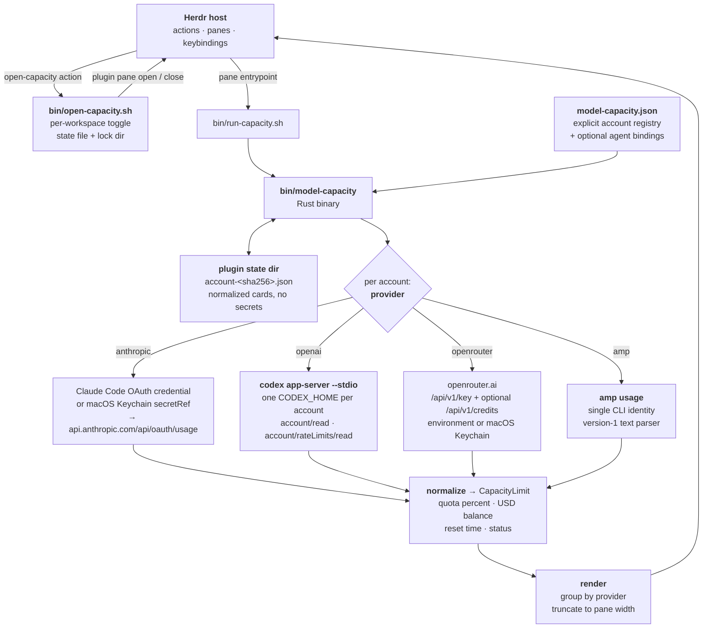
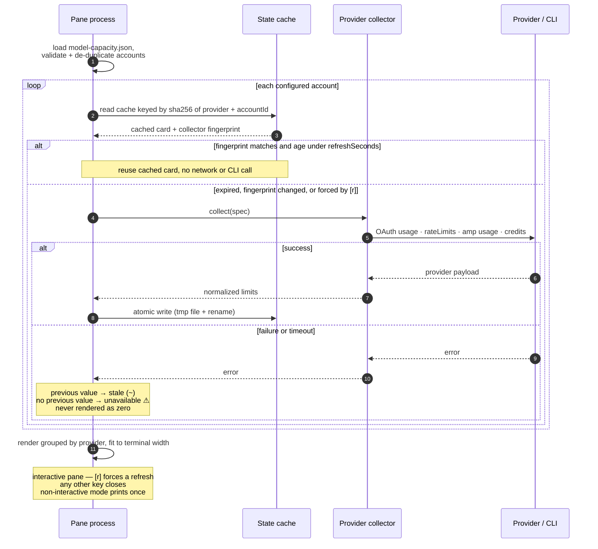

# Herdr Model Capacity

A narrow, persistent [Herdr](https://herdr.dev/) pane showing current capacity
for explicitly configured billing accounts. It reports account quota and credit
headroom, not historical token usage or per-agent spend.

```text
Model Capacity

CLAUDE
───────────────────────────────────
Personal subscription
  5h           ███████████  72%  ↻ 2h12m
  7d           ███████      48%  ↻ 4d8h

CHATGPT / OPENAI
───────────────────────────────────
Work subscription
  7d           █████████████ 82%
```

Configured accounts remain visible when collection fails. A previous successful
value is marked stale; an account with no cached value is shown as unavailable.
Unknown and unsupported capacity is never rendered as zero.

## Architecture

Herdr owns the pane lifecycle, the explicit registry owns account identity, and
each provider's own CLI or credential store owns authentication. The plugin only
normalizes and renders.



Credentials never enter the registry or the state cache. The registry holds
labels, config/home paths, environment-variable *names*, and Keychain
service/account *references* only.

## Refresh flow

Each account is collected independently, and a failure degrades that one card
rather than the pane.



The `collectorFingerprint` covers every input that changes what a collector
reads — config dir, `CODEX_HOME`, env-var names, Keychain reference, settings
path — so editing the registry invalidates that account's cache instead of
showing a value collected from a different source.

## Install and open

Requires Herdr 0.8.0 or newer, Rust/Cargo to build, and Python 3 for pane
toggling:

```bash
herdr plugin install shrivatsas/herdr-model-capacity
```

The default action toggles a non-focused split on the right. It finds the
plugin's pane in the current workspace, closes it if present, and otherwise
opens one:

```bash
herdr plugin action invoke shrivatsa.model-capacity.open-capacity
```

The explicit placement actions replace an existing capacity pane cleanly, so
they can also switch orientation:

```bash
herdr plugin action invoke shrivatsa.model-capacity.open-capacity-right
herdr plugin action invoke shrivatsa.model-capacity.open-capacity-down
```

Example keybindings:

```toml
[[keys.command]]
key = "prefix+u"
type = "plugin_action"
command = "shrivatsa.model-capacity.open-capacity"
description = "toggle model capacity"

[[keys.command]]
key = "prefix+shift+u"
type = "plugin_action"
command = "shrivatsa.model-capacity.open-capacity-down"
description = "move model capacity below"
```

## Configure an explicit account registry

Find the plugin config directory and create `model-capacity.json` there:

```bash
herdr plugin config-dir shrivatsa.model-capacity
```

There is deliberately no implicit account discovery. Labels and account
identity come only from this registry; CLI/harness credential discovery may be
used to help author it, but never defines dashboard accounts.

```json
{
  "refreshSeconds": 180,
  "warningPercent": 20,
  "criticalPercent": 10,
  "accounts": [
    {
      "provider": "openai",
      "accountId": "personal-chatgpt",
      "label": "Personal ChatGPT",
      "authType": "oauth",
      "source": "codex",
      "codexHome": "~/.codex-accounts/personal"
    },
    {
      "provider": "openai",
      "accountId": "work-chatgpt",
      "label": "Work ChatGPT",
      "authType": "oauth",
      "source": "codex",
      "codexHome": "~/.codex-accounts/work"
    },
    {
      "provider": "anthropic",
      "accountId": "work-claude",
      "label": "Work Claude subscription",
      "authType": "oauth",
      "source": "claude-code",
      "configDir": "~/.claude-accounts/work",
      "allowKeychain": true
    },
    {
      "provider": "anthropic",
      "accountId": "personal-claude",
      "label": "Personal Claude subscription",
      "authType": "oauth",
      "source": "claude-code",
      "configDir": "~/.claude-accounts/personal",
      "secretRef": {
        "kind": "macos-keychain",
        "service": "example-herdr-claude",
        "account": "personal"
      }
    },
    {
      "provider": "openrouter",
      "accountId": "personal-openrouter",
      "label": "Personal OpenRouter",
      "authType": "api",
      "source": "openrouter",
      "managementSecretRef": {
        "kind": "macos-keychain",
        "service": "herdr-model-capacity-openrouter",
        "account": "management"
      }
    },
    {
      "provider": "amp",
      "accountId": "amp-billing",
      "label": "Amp billing",
      "authType": "cli",
      "source": "amp-cli"
    }
  ]
}
```

`HERDR_CAPACITY_CONFIG` may override the config path.

### Optional agent linkage

The dashboard is account-only by default. To show an informational agent →
account section at the bottom, set `"showBindings": true` and add explicit
bindings:

```json
{
  "showBindings": true,
  "bindings": [
    {
      "agent": "pi",
      "provider": "anthropic",
      "accountId": "personal-claude"
    }
  ]
}
```

Bindings never create or rename billing accounts. Dynamic Amp routing is not
guessed. An Amp billing account (`"provider": "amp"`) is independent of an
optional Amp agent binding; configuring one does not create the other.

## Provider collection and limitations

### ChatGPT/OpenAI

Each ChatGPT account needs its own `CODEX_HOME`. The plugin starts the official
`codex app-server --stdio` with that home, performs the initialize/initialized
handshake, and requests `account/read` plus `account/rateLimits/read`. It
correlates JSON-RPC responses by ID and ignores interleaved notifications. Codex
owns authentication, storage, and refresh; the plugin never reads `auth.json`
or copies OAuth tokens.

Ordinary OpenAI API keys do not expose a reliable prepaid balance. Such an
account is displayed as unknown rather than using historical organization cost.

### Claude/Anthropic

Claude Code's normal macOS login uses one shared `Claude Code-credentials`
Keychain item. `CLAUDE_CONFIG_DIR` alone therefore does not isolate multiple
subscription logins. `allowKeychain` enables that standard item for an account.

For a credential created with official `claude setup-token`, use a
`macos-keychain` `secretRef`. The plugin asks `security` for the named service
and account and never writes or logs the returned value. Setup tokens can pass
Claude authentication and inference while still receiving HTTP 403 from
Claude's OAuth usage endpoint. The plugin therefore verifies that the reference
exists and shows **quota unsupported for this credential type**; it does not
render the 403 as zero or infer quota from inference success.

The OAuth usage endpoint used for the standard Claude Code credential is not a
documented public API. Successful values are cached; failures retain stale
values. Ordinary Anthropic API keys do not expose a credit-balance endpoint.

### OpenRouter

Create an ordinary inference key on OpenRouter's [API Keys
page](https://openrouter.ai/settings/keys), or create a management key on its
[Management API Keys page](https://openrouter.ai/settings/management-keys).
These credentials report different capacity:

- `tokenEnv` or `tokenSecretRef` uses `/api/v1/key` and reports that individual
  key's **spending limit** and reset policy. This is not the account's purchased
  credit balance. A key without a limit is shown as valid and unlimited at key
  scope, rather than as an authentication failure.
- `managementKeyEnv` or `managementSecretRef` uses `/api/v1/key` to verify the
  credential type and safe masked label, then `/api/v1/credits` to report
  **account-wide OpenRouter credits**.

The configured account label is the card heading; OpenRouter's safe masked
`data.label` appears beneath it as a secondary key ID, so multiple keys remain
distinguishable. The full credential is never shown or cached. A credential
whose actual type does not match its configured field is rejected with a
configuration error.

On macOS, store a management key in Keychain without putting it in Herdr's
launch environment. This command prompts for the key securely (`-w` must remain
the final option):

```bash
security add-generic-password -U \
  -s herdr-model-capacity-openrouter \
  -a management \
  -w
```

Then configure the `managementSecretRef` shown in the registry example above.
For an ordinary key, use a distinct account selector such as `ordinary` and the
field `tokenSecretRef`.

Environment variables remain available for automation:

```json
{
  "tokenEnv": "OPENROUTER_API_KEY"
}
```

or, for account-wide credits:

```json
{
  "managementKeyEnv": "OPENROUTER_MANAGEMENT_KEY"
}
```

Configure exactly one of `tokenEnv`, `managementKeyEnv`, `tokenSecretRef`, or
`managementSecretRef`; combining an environment-variable field with a secret
reference is an error. With one explicit field, that source is authoritative
and ambient variables are ignored. With none, collection falls back first to
`OPENROUTER_API_KEY`, then to the OpenRouter API key in a configured
`piAuthPath`. Secret-reference selectors are included in cache fingerprints,
but resolved keys are not.

### Amp

An Amp account runs the official authenticated `amp usage` command. Amp CLI
owns login and credential storage; the plugin does not read Amp token files or
call Amp's internal billing API. The command runs non-interactively with null
stdin, color disabled, and a 10-second overall timeout.

The parser supports the current version-1 text forms for Amp Free dollar or
daily-percent capacity, separate subscription “other” and “orb” lanes,
individual credits, and multiple workspace balances. Dollar balances render as
dollars. A subscription renewal timestamp is only approximated when the CLI
reports a number of days; “resets daily” is retained as detail without inventing
an exact timestamp. Identity lines and trailing CLI advice are ignored, and the
registry's `accountId` and `label` remain authoritative.

Amp CLI currently exposes one authenticated identity to `amp usage`, so only one
Amp billing account may be configured. A missing CLI, signed-out identity,
timeout, command error, or unrecognized capacity text makes a never-fetched card
unavailable and retains a previous successful value as stale—never as zero.
Because `amp usage` is a human-readable, versioned text contract, a future CLI
wording change may require a parser update.

## Security model

- The registry stores labels, home/config paths, environment-variable names,
  and Keychain service/account references—never OAuth or setup-token values.
- Codex app-server is the sole owner of Codex auth and refresh.
- Amp CLI is the sole owner of Amp authentication; Amp credentials and raw
  identity output are not stored.
- Provider responses cached under the plugin state directory contain normalized
  limits, safe masked OpenRouter key labels, and errors—not credentials.
- Diagnostics do not include secret values.

## Development

`plugin link` does not run manifest build commands, so build first:

```bash
cargo test
bash bin/build.sh
herdr plugin link "$PWD"
```

Focused checks:

```bash
cargo fmt --check
cargo test
cargo clippy --all-targets -- -D warnings
bash -n bin/*.sh
```

For a manual smoke test with one explicit account card for every provider and
agent bindings hidden, run:

```bash
bash bin/manual-test.sh
```

Use `--probe` for normalized JSON or `--herdr` to back up the current plugin
registry, install the four-provider test registry, and link this checkout. The
script includes each account home under `~/.claude-accounts` and
`~/.codex-accounts`; `~/.claude` and `~/.codex` are used only when their account
directories are absent.

The original implementation brief and research notes are in [SPEC.md](SPEC.md).

## License

[MIT](LICENSE)
